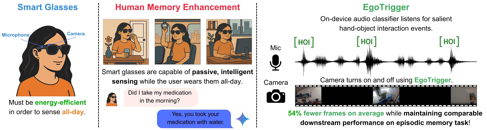

# EgoTrigger: Toward Audio-Driven Image Capture for Human Memory Enhancement in All-Day Energy-Efficient Smart Glasses

<p align="center">
:fire: Please remember to :star: this repo if you find it useful and <a href="https://github.com/yahskapar/EgoTrigger#scroll-citation">cite</a> our work if you end up using it in your work! :fire:
</p>
<p align="center">
:fire: If you have any questions or concerns, please create an issue :memo:! :fire:
</p>

<p align="center">
<a href="https://arxiv.org/abs/2508.01915">Pre-print</a> | <a href="https://egotrigger.github.io/">Project Website</a>
</p>



## :book: Abstract

All-day smart glasses are likely to emerge as platforms capable of continuous contextual sensing, uniquely positioning them for unprecedented assistance in our daily lives. Integrating the multi-modal AI agents required for human memory enhancement while performing continuous sensing, however, presents a major energy efficiency challenge for all-day usage. Achieving this balance requires intelligent, context-aware sensor management. Our approach, EgoTrigger, leverages audio cues from the microphone to selectively activate power-intensive cameras, enabling efficient sensing while preserving substantial utility for human memory enhancement. EgoTrigger uses a lightweight audio model (YAMNet) and a custom classification head to trigger image capture from hand-object interaction (HOI) audio cues, such as the sound of a drawer opening or a medication bottle being opened. In addition to evaluating on the QA-Ego4D dataset, we introduce and evaluate on the Human Memory Enhancement Question-Answer (HME-QA) dataset. Our dataset contains 340 human-annotated first-person QA pairs from full-length Ego4D videos that were curated to ensure that they contained audio, focusing on HOI moments critical for contextual understanding and memory. Our results show EgoTrigger can use 54% fewer frames on average, significantly saving energy in both power-hungry sensing components (e.g., cameras) and downstream operations (e.g., wireless transmission), while achieving comparable performance on datasets for an episodic memory task. We believe this context-aware triggering strategy represents a promising direction for enabling energy-efficient, functional smart glasses capable of all-day use -- supporting applications like helping users recall where they placed their keys or information about their routine activities (e.g., taking medications).

## 📝 Project Status

- [x] Release HME-QA annotations (`HME-QA_annotations_v0.json`)from pilot dataset corresponding to the ISMAR 2025 TVCG Journal Paper.
- [] Release EgoTrigger model training and evaluation pipeline with publicly available dependencies.

Note: The model training ande valuation pipeline release may take longer than I expected due to various release constraints and other work - if you cannot wait for this release, the paper itself is plenty to reproduce EgoTrigger. Feel free to reach out, either via a GitHub issue or email, in case you run into any troubles with reproducing model training and/or evaluation as per the paper.

## :wrench: Setup

For the time being, the only setup required is running `pip install ego4d` outside of a conda environment, in order to utilize the `download_videos.sh` script to retrieve the videos corresponding to the annotations in `HME-QA_annotations_v0.json`.

## :computer: Usage

For the time being, the only usage possible is using `download_videos.sh` to retrieve the videos corresponding to the annotations in `HME-QA_annotations_v0.json`.

## :scroll: Acknowledgments

Akshay Paruchuri conducted this research during an internship under the mentorship of Ishan Chatterjee at Google AR in Seattle, WA, USA. The authors thank the following colleagues at Google for insightful discussions around multimodal sensing and energy efficient computing: Zhihan Zhang, Jake Garrison, Shamik Ganguly, Zixuan Qu, and Anish Prabhu.

## :scroll: Citation
If you find our [paper](https://arxiv.org/abs/2508.01915) or this toolbox useful for your research, please cite our work.

```
@article{paruchuri2025egotrigger,
  title={EgoTrigger: Toward Audio-Driven Image Capture for Human Memory Enhancement in All-Day Energy-Efficient Smart Glasses},
  author={Paruchuri, Akshay and Hersek, Sinan and Aggarwal, Lavisha and Yang, Qiao and Liu, Xin and Kulshrestha, Achin and Colaco, Andrea and Fuchs, Henry and Chatterjee, Ishan},
  journal={arXiv preprint arXiv:2508.01915},
  year={2025}
}
```